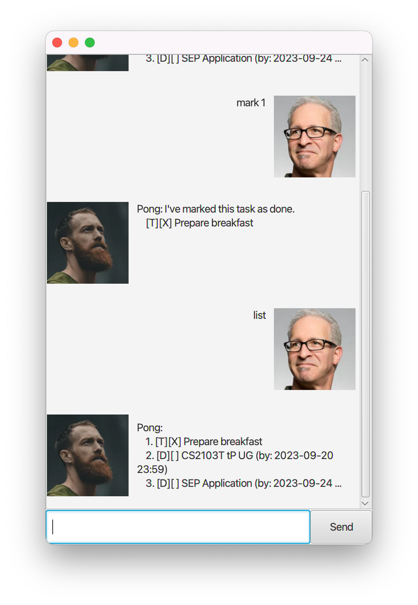

# Pong User Guide



## Features 

### List tasks (`list`)

Lists all tasks.

### Add todo (`todo`)

Adds todo task.

### Add deadline (`deadline`)

Adds deadline task.

### Add event (`event`)

Adds event task.

### Mark task (`mark`)

Marks task as done.

### Unmark task (`unmark`)

Marks task as **not** done.

### Delete task (`delete`)

Deletes task.

### Exit application (`bye`)

Exits Duke chatbot.

## Usage

### `list` - Lists tasks

Lists all tasks.

Format:

`list`

Example of usage: 

`list`

Expected outcome:

Notice that pong will output all tasks, their types and whether they are marked as done.

```
  1. [T][X] Prepare breakfast
  2. [D][ ] CS2103T tP UG (by: 2023-09-20  23:59)
  3. [D][ ] SEP Application (by: 2023-09-24 23:59)
```

### `todo` - Add todo

Add todo task.

Format:

`todo <Todo name>`

Example of usage:

`todo Prepare breakfast`

Expected outcome:

```
[Added] [T][ ] Prepare breakfast
```

### `deadline` - Add deadline

Add deadline task.

Format:

`deadline <Deadline name> /by <Deadline date>` (date in `yyyy/MM/dd [HHmm]`)

Example of usage:

`deadline CS2103T tP UG /by 2023/09/20 2359`

Expected outcome:

```
[Added] [D][ ] CS2103T Lecture (by: 2023-09-20 23:59)
```

### `event` - Add event

Add event task.

Format:

`event <Event name> /from <Event start> /to <Event end>` (dates in `yyyy/MM/dd [HHmm]`)

Example of usage:

`event CS2103T Lecture /from 2023/09/22 1600 /to 2023/09/22 1800`

Expected outcome:

```
[Added] [E][ ] CS2103T Lecture (from: 2023-09-22 16:00, to: 2023-09-22 18:00)
```

### `mark` - Mark task

Marks task as done.

Format:

`mark <index>`

Example of usage:

`mark 1`

Expected outcome:

```
I've marked this task done.
 [T][X] Prepare breakfast
```

### `unmark` - Unmark task

Marks task as **not** done.

Format:

`unmark <index>`

Example of usage:

`unmark 1`

Expected outcome:

```
I've marked this task not done.
 [T][ ] Prepare breakfast
```

### `delete` - Deletes task

Deletes task.

Format:

`delete <index>`

Example of usage:

`delete 1`

Expected outcome:

```
[Deleted] [T][ ] Prepare breakfast
```
